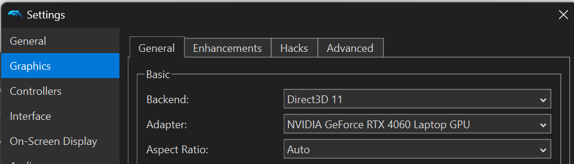
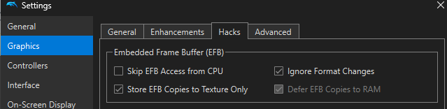
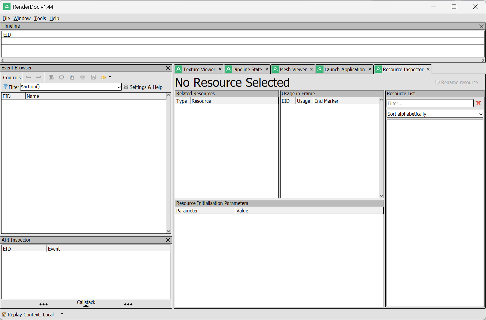
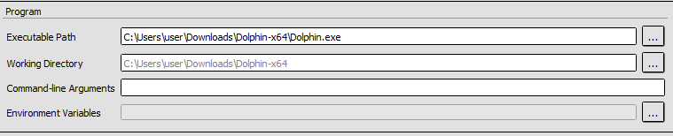
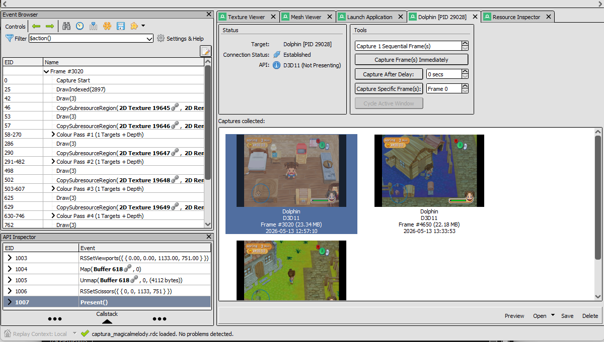
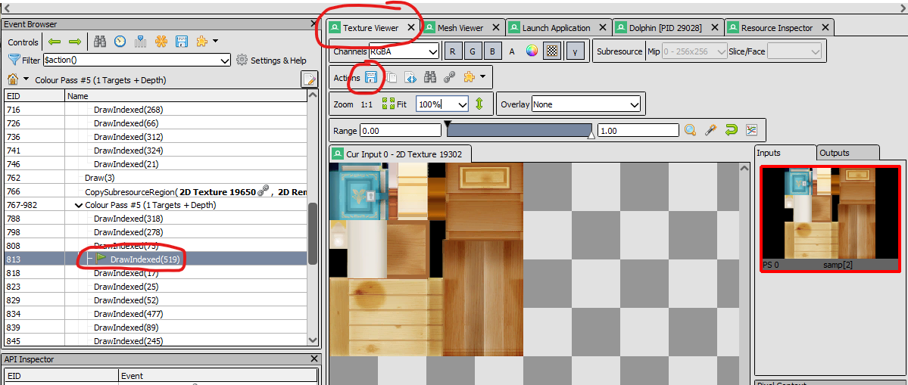
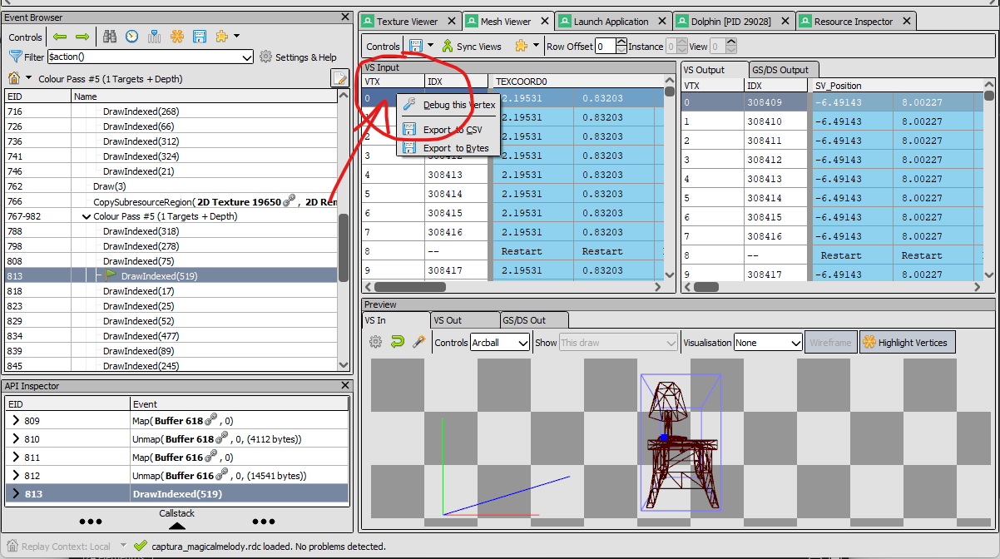

# Extract models and textures from Dolphin emulation

This is the guide I wish I had when I started, so I hope it's helpful for you!

I actually haven't tried with other games or other consoles, but it should work the same way.

⚠️ **Recommendations** ⚠️
- Opening Dolphin from Renderdoc runs games reaaaaaally slowly, like at 4 fps. If you still haven't played the game, start a new run before this process and save the game at least in one state slot, so when you open Dolphin from Renderdoc you can directly load the game at your desired spot.

- The object you want must be visible on screen.
  
- Save the .csv and .png files in the same folder as the script to make it faster.

## Step 1: Set up Dolphin Emulator

1. Download latest dolphin version: 
2. Head to **Settings/Config** -> **Graphics** and in the **General** tab you'll see the **Backend** option. Set it to: `Direct3D 11`

3. Now in the same **Graphics** section, head to the **Hacks** tab. Uncheck `Skip EFB Access from CPU`

## Step 2: Launch Dolphin from within RenderDoc
Close Dolphin Emulator and open RenderDoc. You'll be greeted with the following screen:

Go to **File** -> **Launch Application** and change the following options:

- Executable Path -> path to Dolphin.exe
- Working Directory -> Dolphin's folder

As in the picture:

Click on **Launch**.
Now Dolphin will start normally. Open your game, load the save/state and head back to RenderDoc. You'll see a new tab has opened with the name Dolphin.

## Step 3: Capture frames

1. Press **Capture Frame(s) Immediately**. A screenshot of the game will appear.
2. Select the capture and save it.
3. To open it, double-click it.

You can now navigate between the **Texture Viewer** and the **Mesh Viewer**. 

# Texture Viewer
1. To actually see some textures, look at the left panel "**Event Browser**". The objects drawn to the buffer are the ones in the **Colour Pass #** sections: `DrawIndexed(x)`.
2. Select any of the objects and its texture will appear. If you see on the right panel the texture but doesn't appear on the viewport (under the save icon), click the texture on the right panel.
3. To save it, click on the blue save icon in **Actions**. ⚠️MAKE SURE TO CHANGE THE OUTPUT TYPE OF FILE TO A DESIRED ONE (for example .png)!

# Mesh Viewer
1. With the same object selected as in the Texture Viewer, head to the **Mesh Viewer** tab. Here you'll see tables containing numbers. Those are the vertex coordinates for the model and textures.
2. At the bottom of the screen you have the **VS In** and **VS Out** tabs. These show the actual mesh (without textures).
   - **VS In** shows the mesh as given to the engine to draw, it's like the raw model at the (0,0,0) position.
   - **VS Out** shows the model as it's drawn on the scene, as we see it in game.
3. To save the mesh, right-click on the first cell of the **left** table (**VS Input**), under "VTX" -> **Export to CSV**

