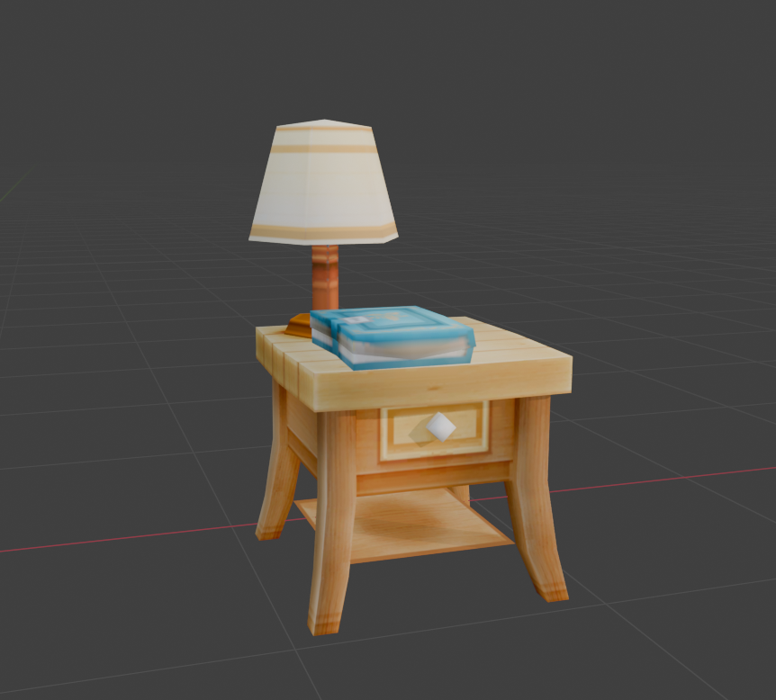

# GameCube RenderDoc OBJ Exporter

A Python script to convert RenderDoc `VS Input` .csv exports from GameCube games into proper `.obj` 3D models with textures.

## Requirements

- [Python 3.x](https://www.python.org/downloads/) (no external libraries needed, uses built-in `csv` module)
- [RenderDoc](https://renderdoc.org/) for capturing and exporting vertex data
- Blender (or any 3D viewer that supports `.obj`) to view the result

## How to Capture the Data in RenderDoc
See `ExtractModels.md` for instructions on how to do this.

## Usage

1. Download the script.py from the latest release.
2. Open a cmd in the folder where you saved the script (Make sure to have the .csv and texture files here too!) and run the command:

```bash
python script.py
```
3. It will ask you to enter the names of the files **with the extension**. Write and press enter.
4. If everything is good, it will tell you the .obj and .mtl were made successfully.
5. Open a 3D editing program (e.g Blender) and import the obj, you should be able to see the object perfectly rendered.

Note: sometimes a single object was extracted in many parts. In that case you have to repeat this process for each of the draw calls in Renderdoc, having multiple .csv for one object. Then in the 3D editing tool, join all the parts and you have the complete 3D object!


